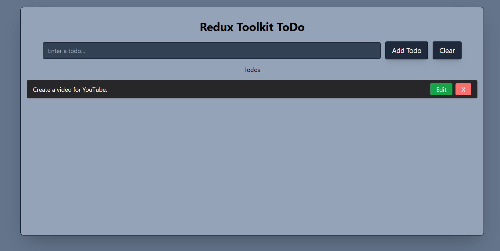
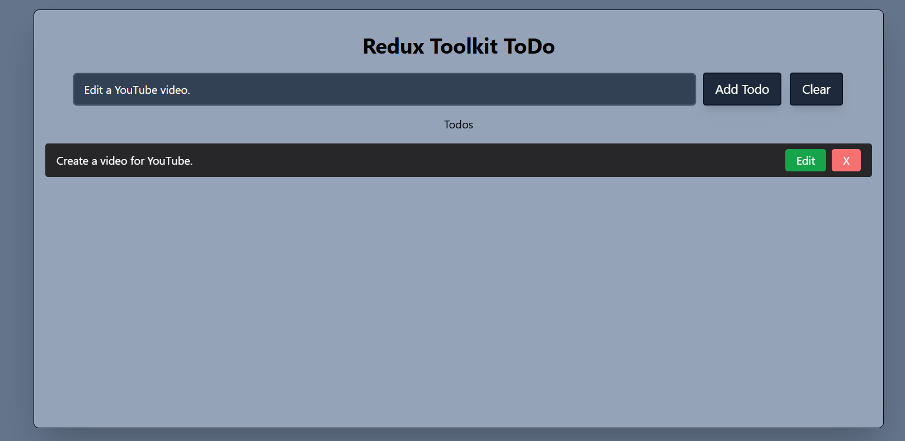
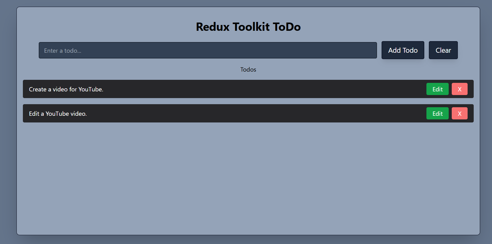
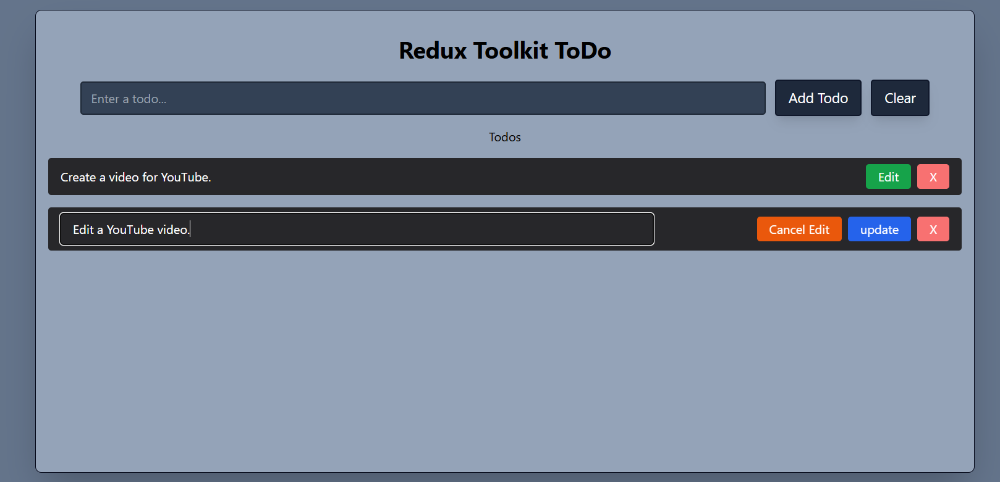
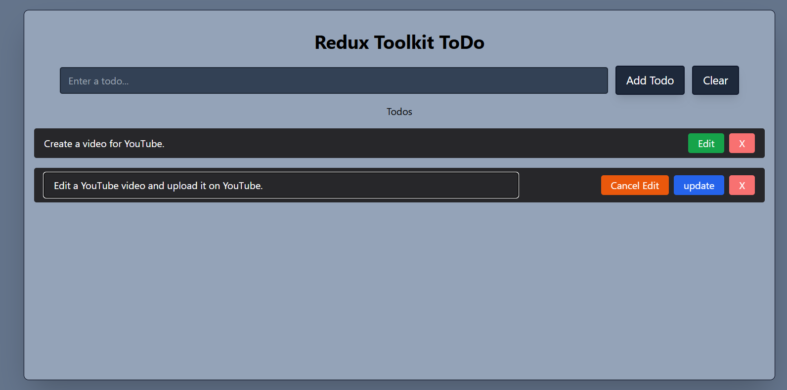
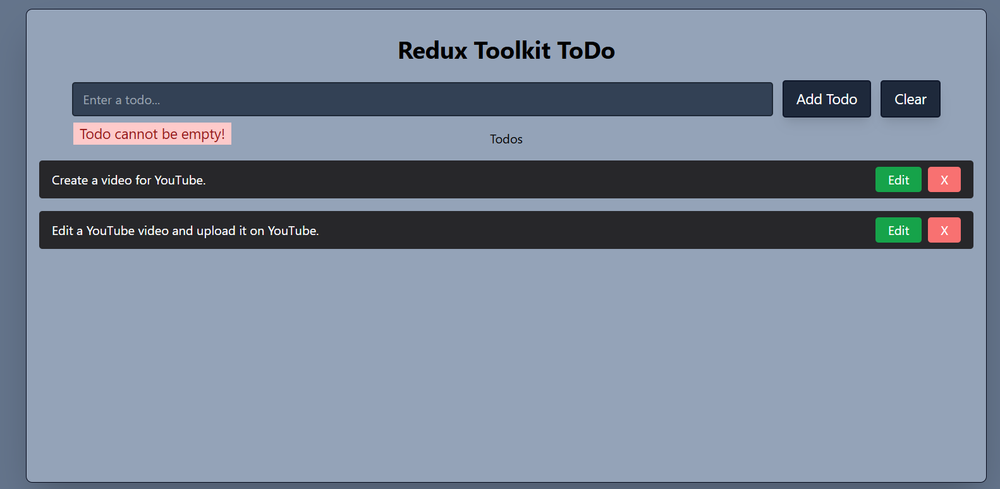
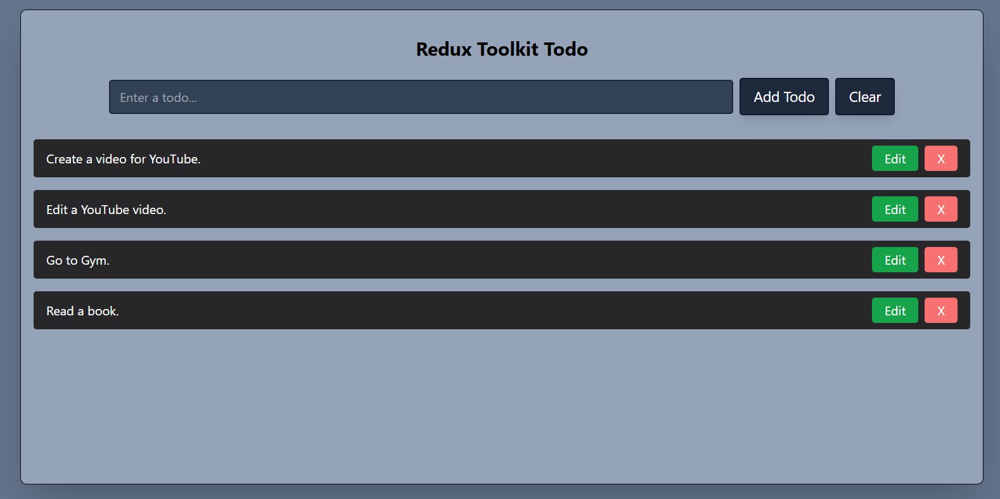
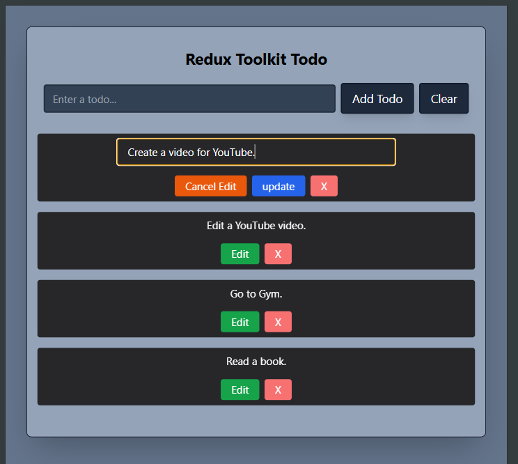
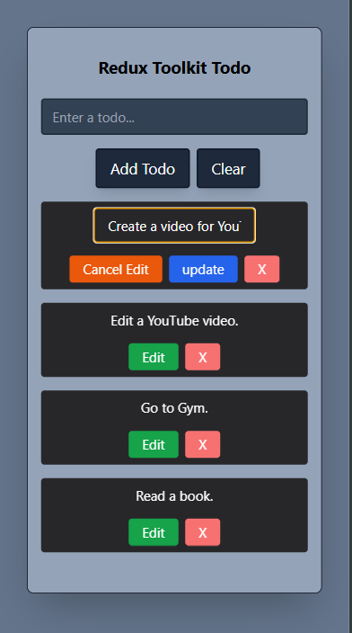

# A mini Todo app created using React JS and Redux toolkit.

🖥️ [View it live](https://razi-azam.github.io/redux-toolkit-toDo/)

## Added the following new features.
- Changed the complete look and feel of the UI.
- Made the app responsive by adding a custom breakpoint to Tailwind.
- Added validation to prevent adding an empty todo.
- Added an extra "Clear" button to celar the text of the input field.
- Added an "Edit" button. When the user click it, two buttons will appear i.e. ```Cancel Edit``` and ```Update```.
- In case if the user don't want to update, then the ```Cancel Edit``` button can be clciked to cancel the edit.
- The ```Update```. button is used to update the existing todo.
- The ```useRef``` hook is used to set the focus of the input field when the Edit button is clicked.

## Screenshots of the Todo app
### Initial Screem


### Add a todo



### Edit a todo



### Try to add an empty todo


### Desktop View


### Tablet View


### Mobile View

